# UWConnect
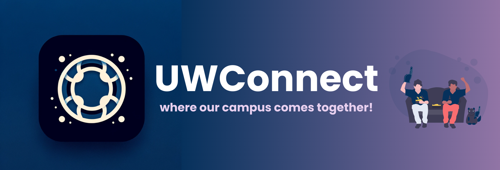

UWConnect is an innovative platform designed to enhance the connectivity and collaboration among University of Waterloo students, faculty, and staff. By facilitating more direct communication and providing a centralized hub for resources and information, UWConnect aims to make campus life more integrated and accessible for everyone involved! Whether you're looking to join a group related to your interests, find campus events, or connect with peers and professors, UWConnect is your go-to solution!

> This is a video! Click on it to see the project walkthrough rather than having to read all our documentation!

## Table of Contents

- [Product Showcase](#product-showcase)
- [Team Information](#team-information)
- [User Documentation](#user-documentation)
- [Design Documentation](#design-documentation)
- [Software Releases](#software-releases)
- [Meeting Minutes, Developer Journals, and Final Reflections](#meeting-minutes-developer-journals-and-final-reflections)
- [Third-Party Acknowledgements](#third-party-acknowledgements)
- [Copyright and License](#copyright-and-license)

## Product Showcase

<table>
<tr>
<td>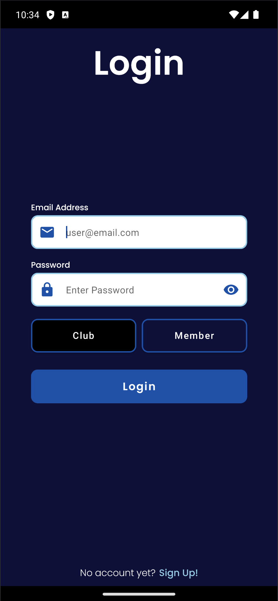</td>
<td>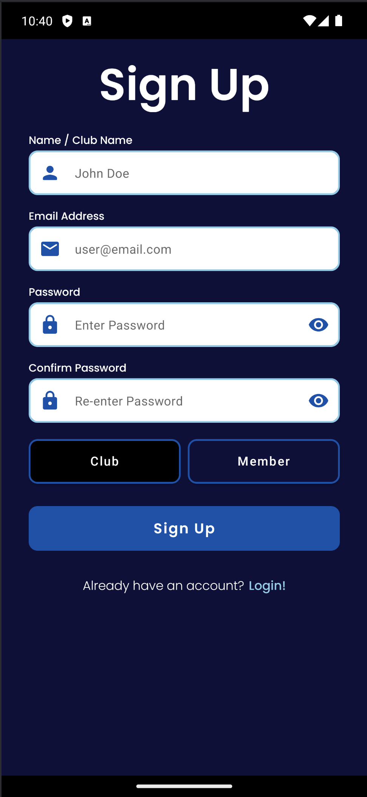</td>
<td>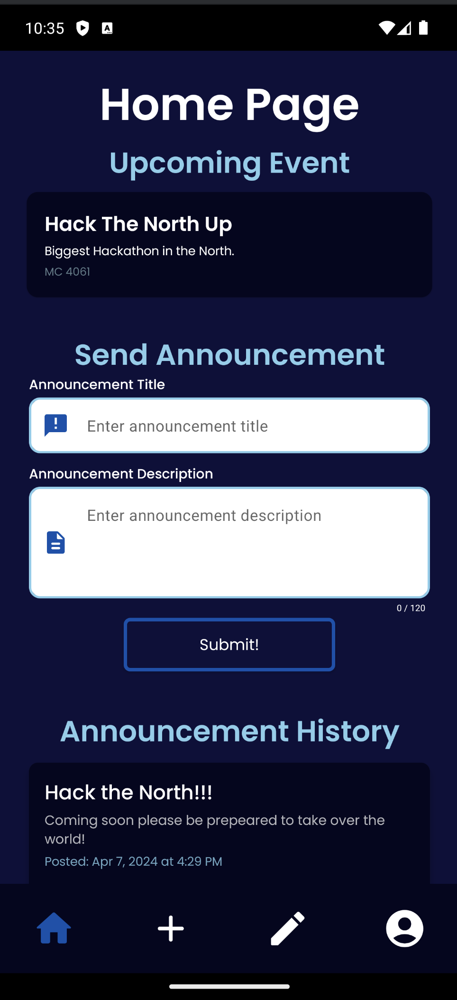</td>
<td>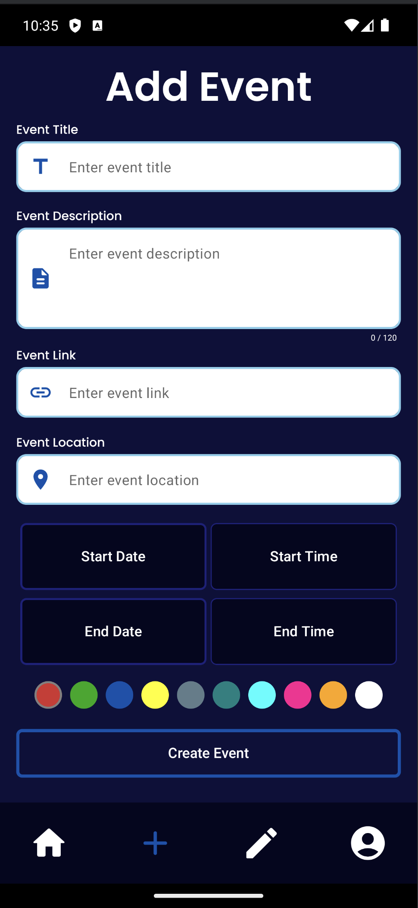</td>
</tr>
<tr>
<td>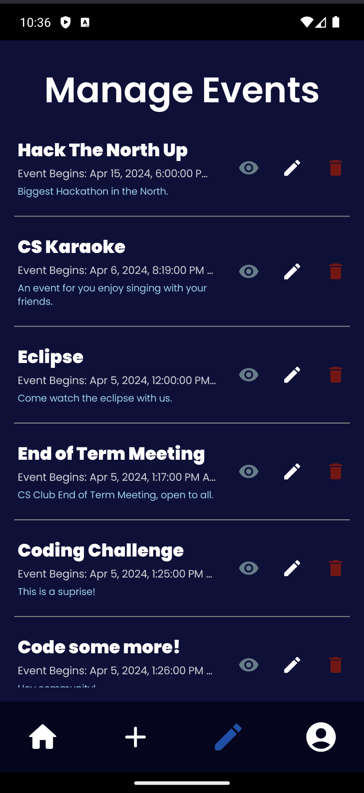</td>
<td>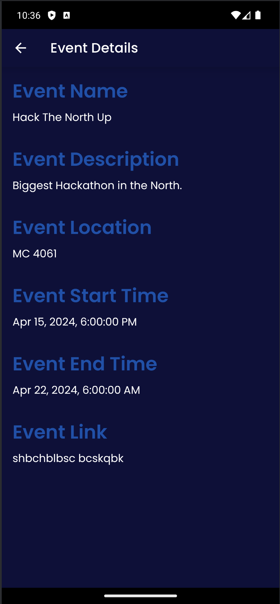</td>
<td>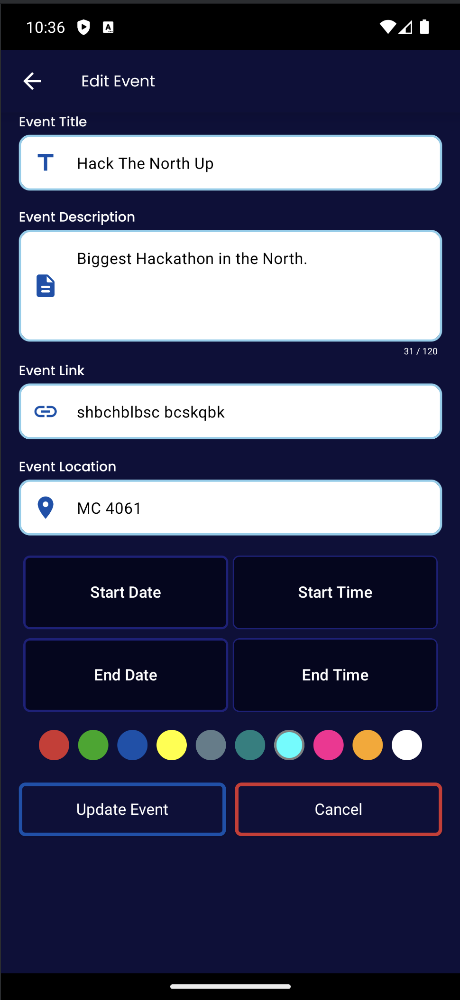</td>
<td>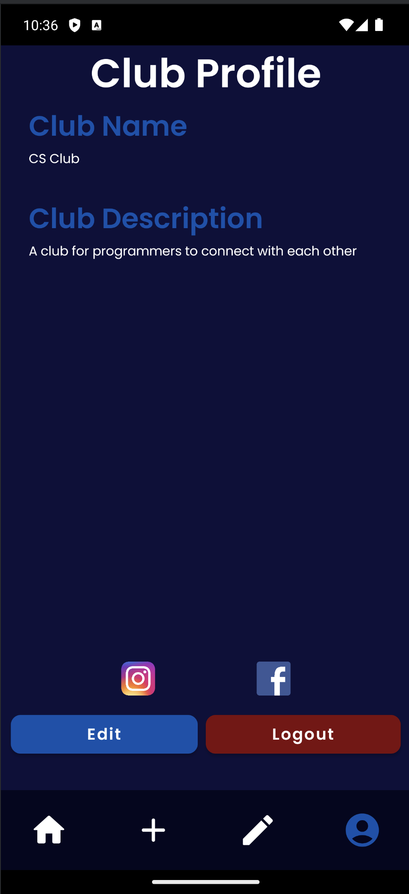</td>
</tr>
<tr>
<td>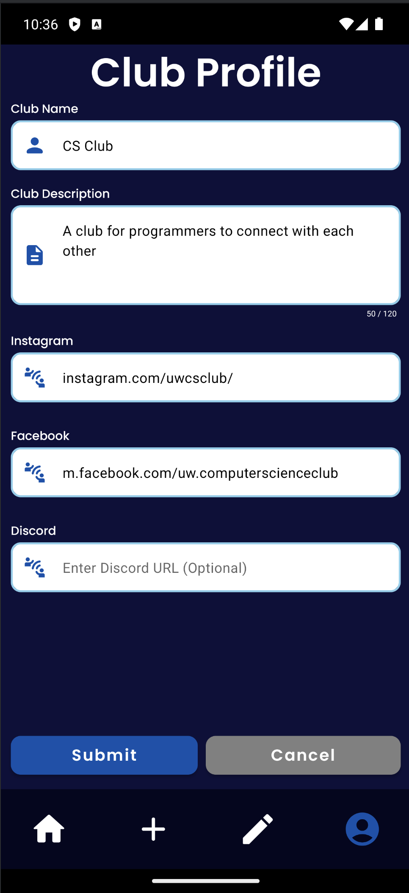</td>
<td>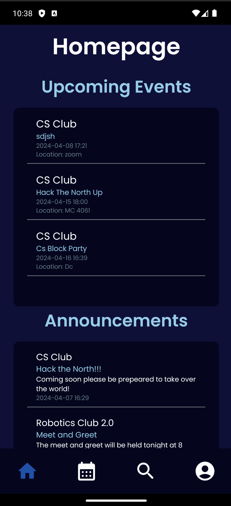</td>
<td>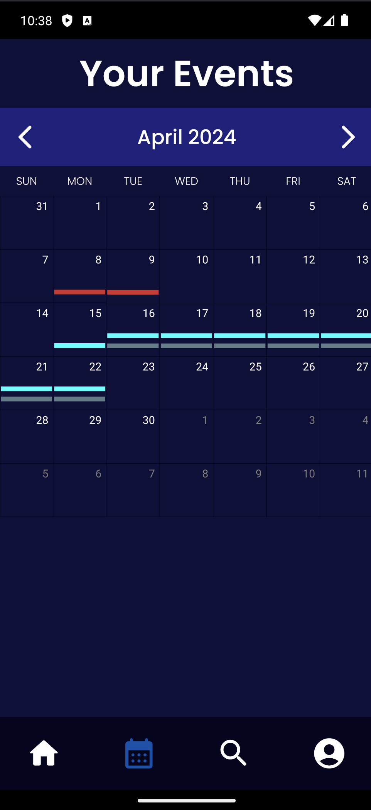</td>
<td>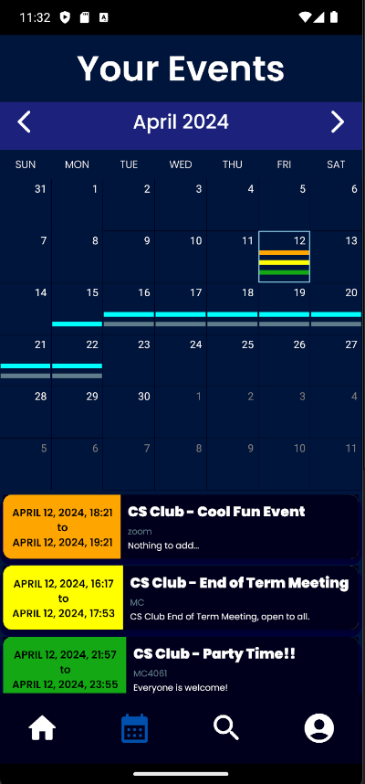</td>
</tr>
<tr>
<td>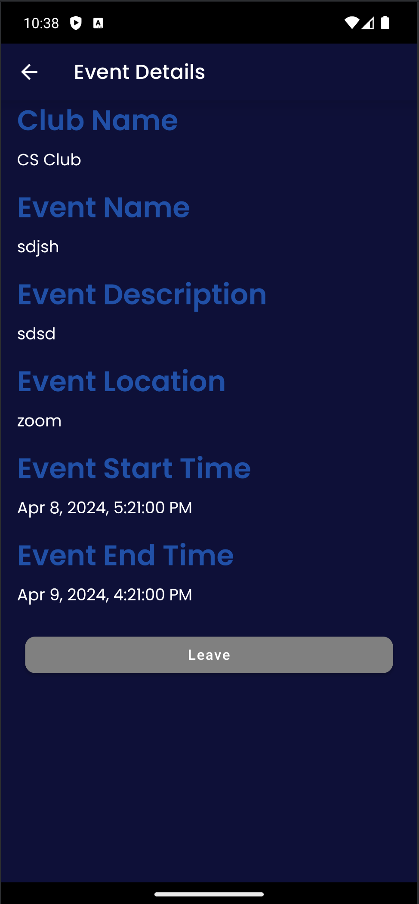</td>
<td>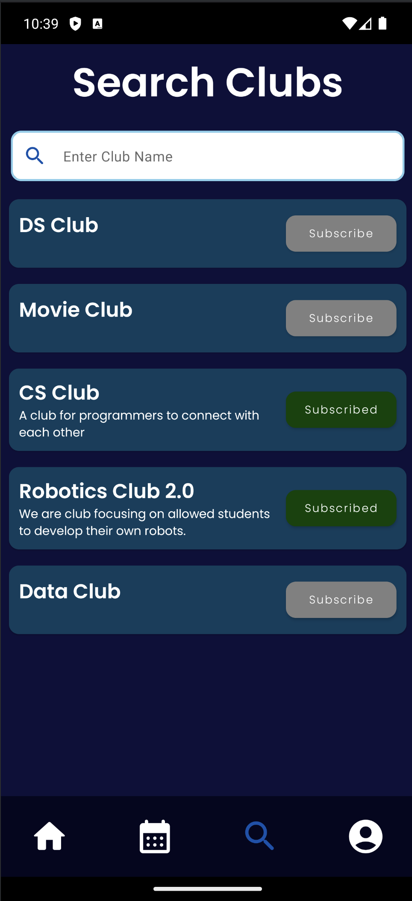</td>
<td>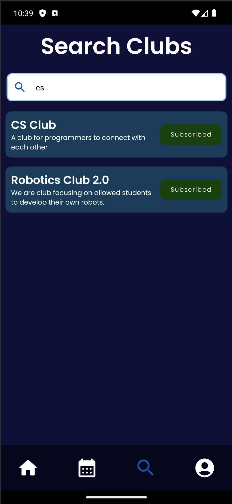</td>
<td>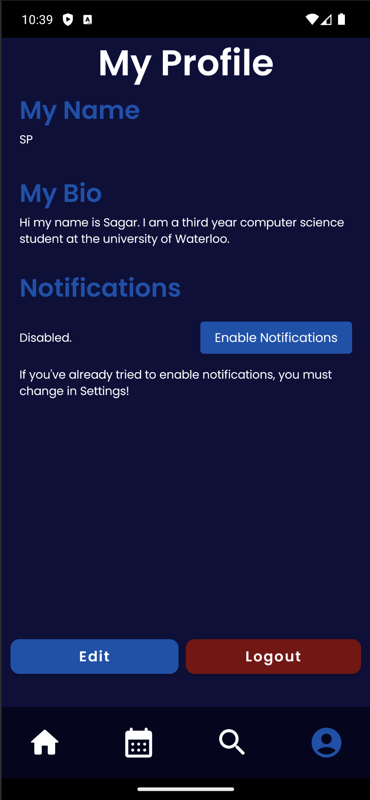</td>
</tr>
<tr>
<td>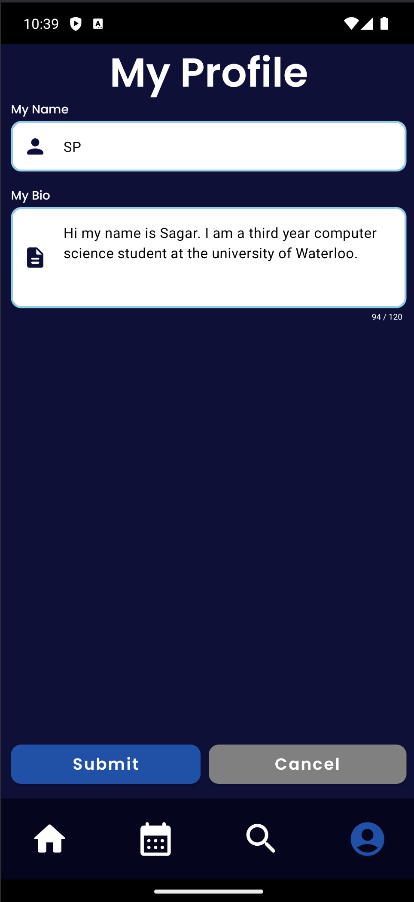</td>
<td>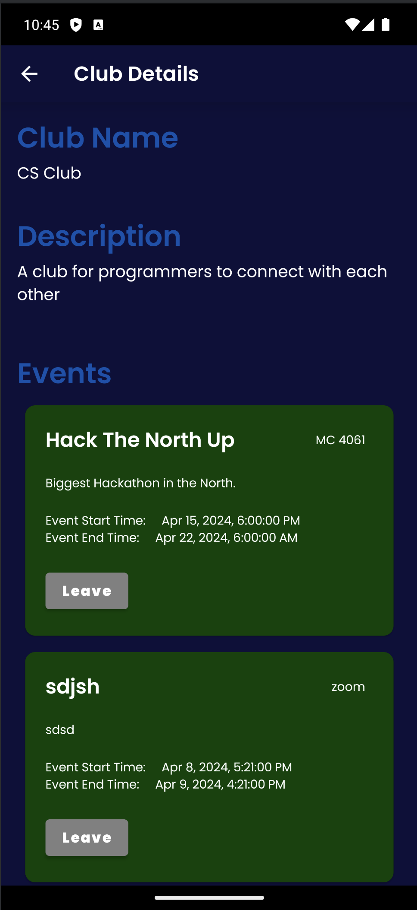</td>
</tr>
</table>

## Team Information

|                                              <a href="" target="_blank">**Sagar Patel**</a>                                               |                                           <a href="" target="_blank">**Ibrahim Kashif**</a>                                           |                                            <a href="" target="_blank">**Alex Yu**</a>                                             |                                           <a href="" target="_blank">**Eric Liu**</a>                                           |
|:-----------------------------------------------------------------------------------------------------------------------------------------:|:-------------------------------------------------------------------------------------------------------------------------------------:|:---------------------------------------------------------------------------------------------------------------------------------:|:-------------------------------------------------------------------------------------------------------------------------------:|
|  |  |  |  |
|                                                           sa24pate@uwaterloo.ca                                                           |                                                         i2kashif@uwaterloo.ca                                                         |                                                        a85yu@uwaterloo.ca                                                         |                                                       e82liu@uwaterloo.ca                                                       |

## Third-Party Acknowledgements

UWConnect utilizes several third-party libraries and tools, which are listed as follows:
- **Calendar Library by Kizito Nwose**: [GitHub Repository](https://github.com/kizitonwose/Calendar)
    
    For the calendar functionality within UWConnect, we utilized the "Calendar" library by Kizito Nwose. This library provided the foundational components needed to implement a feature-rich calendar interface, enhancing our application's usability and user experience.

## Copyright and License

(c) 2024 UWConnect Team. UWConnect is licensed under [MIT License](./LICENSE).

